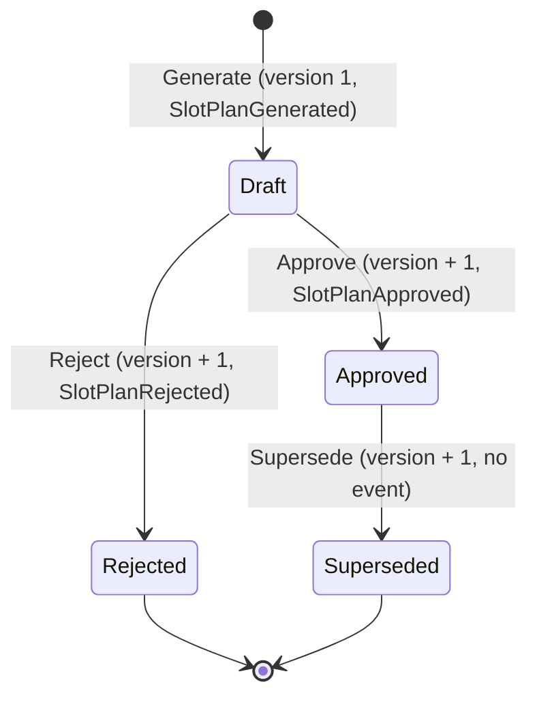

# Aggregate design canvas: `SlotPlan`

ddd-crew [Aggregate Design Canvas v1.1](https://github.com/ddd-crew/aggregate-design-canvas)
for the only aggregate of the context, `slotplan.SlotPlan`
(`internal/domain/slotplan`).

## 1. Name

**SlotPlan**: one proposal of SKU-to-forward-slot assignments for one site
and demand window, and the decision taken on it.

## 2. Description

Created complete by `Generate` from the planner's result, then only its
decision changes. Its content (assignments, moves, unassigned) is written
once and never edited. It is identified by `plan-<uuid>` and belongs to one
site.

## 3. State transitions

Source: `internal/domain/slotplan/plan.go` (`Generate`, `Approve`, `Reject`,
`Supersede`), `internal/domain/slotplan/values.go` (`State`).

## 4. Enforced invariants

Checked by `Restore`, which `Generate` also goes through, so a corrupt row
can never become a live aggregate.

| Invariant | Error |
| --- | --- |
| Plan id is `plan-` plus a non-empty suffix; site, policy, SKUs and slot codes are 1 to 64 characters with no whitespace, control characters or `/` | `ErrInvalidPlanID`, `ErrInvalidSiteID`, `ErrInvalidPolicy`, `ErrInvalidSKU`, `ErrInvalidSlotCode` |
| Window `from` before `to`, both set | `ErrInvalidWindow` |
| A SKU appears in at most one assignment; a slot holds at most one SKU | `ErrDuplicateSKU`, `ErrDuplicateSlot` |
| Every assignment has a valid ABC class, `picks >= 1`, `units >= 0` | `ErrInvalidABCClass`, `ErrInvalidMetric` |
| Moves: one per SKU, a known kind; `Assign` has only `to`, equal to the SKU's slot; `Relocate` has different `from` and `to`, `to` equal to the SKU's slot; `Vacate` has only `from` and the SKU is not assigned | `ErrInvalidMoveKind`, `ErrInvalidMove` |
| Unassigned: one per SKU, a known reason, never an assigned SKU | `ErrInvalidReason`, `ErrInvalidUnassigned` |
| Each state has exactly one legal set of decision timestamps (Draft none, Approved `approvedAt`, Rejected `rejectedAt`, Superseded `approvedAt` and `supersededAt`); a reject reason only on Rejected; `supersedes` only on Approved or Superseded and never the plan itself | `ErrInvalidState`, `ErrInvalidSnapshot`, `ErrInvalidSupersedes` |
| `generatedAt` set and `version >= 1` | `ErrInvalidSnapshot` |
| Only a Draft can be approved or rejected | `ErrNotDraft` (`409 plan-not-draft`) |
| Only an Approved plan can be superseded | `ErrNotApproved` |
| Reject reason, trimmed, at most 500 characters | `ErrRejectReasonTooLong` |

## 5. Corrective policies (rules that span aggregates)

| Rule | Where it is enforced |
| --- | --- |
| At most one Approved plan per site | `ApprovePlan` supersedes and saves the previous Approved plan **before** approving the new one, in the same unit of work; the partial unique index `uq_slot_plans_one_approved_per_site` backs it; the loser of a race gets `409 approved-plan-conflict` |
| Stickiness against the previous map | `GeneratePlan` reads the Approved plan's map and hands it to the planner as `Previous` |

## 6. Handled commands and created events

| Command | Pre-condition | Event | Payload highlights |
| --- | --- | --- | --- |
| `Generate(NewPlan, now)` | the proposal is valid | `SlotPlanGenerated` | window, policy, assignment, move and unassigned counts |
| `Approve(supersedes, now)` | state Draft | `SlotPlanApproved` | full `{sku, slot}` map, moves, `supersedes_plan_id` |
| `Reject(reason, now)` | state Draft, reason length | `SlotPlanRejected` | reason |
| `Supersede(now)` | state Approved | none | (carried by the newer `SlotPlanApproved`) |

Every event carries the plan id, site, aggregate version after the change
and the time (`slotplan.Header`).

## 7. Throughput

| Metric | Estimate |
| --- | --- |
| Command handling rate | low: a planner generates and decides a few plans per site per day or week |
| Total number of clients | a handful of planners, the console and an agent (none wired yet) |
| Concurrency conflict chance | low; the realistic one is two approvals of one site at once, handled by the version guard and the unique index |

## 8. Size

| Metric | Estimate |
| --- | --- |
| Event growth rate | three events per plan at most (generated, then approved or rejected) |
| Lifetime | forever: plans are the audit trail and are never deleted |
| Number of entities | one row in `slot_plans` plus one row per assignment, move and unassigned SKU, bounded by the number of forward slots and candidate SKUs of the site |

## Design notes

- The plan is computed **outside** the aggregate by the pure
  `planning.Planner`; the aggregate only validates and records it. That
  keeps the policy replaceable (`SlotRankingPolicy`) without touching the
  aggregate.
- Optimistic concurrency: `SlotPlanRepository.Save(p, loadedVersion)`
  updates only `WHERE version = loadedVersion`
  (`409 concurrent-modification` otherwise).
- Assignments, moves and unassigned entries are stored sorted by SKU, so the
  same proposal always yields the same plan.
