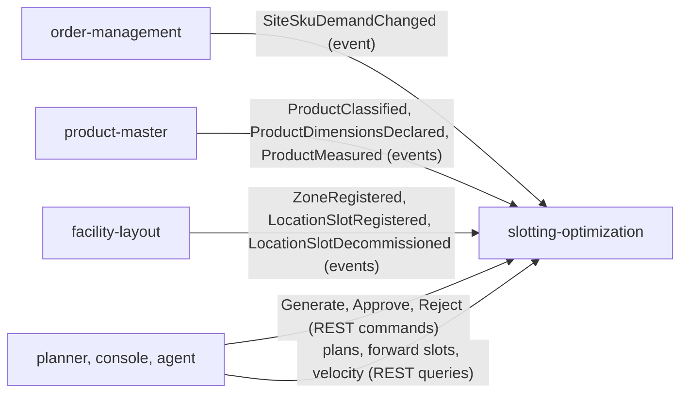
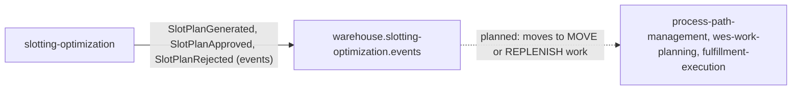

# Bounded context canvas

ddd-crew [Bounded Context Canvas v5](https://github.com/ddd-crew/bounded-context-canvas),
filled from the code on `develop` and ADR 0001.

## Name

**slotting-optimization**

## Purpose

Decide, explainably and repeatably, which SKUs get a forward pick slot and
which slot each one gets; let a person approve or reject that proposal; and
publish the approved assignment map with the physical moves it implies.

## Strategic classification

| Dimension | Value |
| --- | --- |
| Domain | **Supporting** ([Subdomain classification](/docs/ddd/subdomain-classification)) |
| Tier | WMS, CloudEvents subdomain `wms` |
| Business model | Cost reduction (pick travel and labor) |
| Evolution | Custom-built, genesis |

## Domain roles

- **Policy engine**: computes a proposal from declarative inputs
  (`planning.Planner`, policy `abc-velocity-v1`).
- **Approval workflow**: a Draft becomes Approved or Rejected by a human
  decision; the previous Approved plan of the site becomes Superseded.

## Inbound communication

Source: `internal/adapters/inbound/kafka/{demand,product,layout}_consumer.go`,
`internal/adapters/inbound/http/server.go`.

| Collaborator | Message | Kind | Channel |
| --- | --- | --- | --- |
| order-management | `SiteSkuDemandChanged` | event | `warehouse.order-management.events` |
| product-master | `ProductClassified`, `ProductDimensionsDeclared`, `ProductMeasured` | events | `warehouse.product-master.events` |
| facility-layout | `ZoneRegistered`, `LocationSlotRegistered`, `LocationSlotDecommissioned` | events | `warehouse.facility.events` |
| planner (human, console, agent) | Generate slot plan, Approve, Reject | commands | `POST /slot-plans`, `POST /slot-plans/{planId}/approve`, `POST /slot-plans/{planId}/reject` |
| planner (human, console, agent) | Get plan, List plans, Forward slots, SKU velocity | queries | `GET /slot-plans/{planId}`, `GET /slot-plans`, `GET /forward-slots`, `GET /sku-velocity` |

## Outbound communication

Source: `internal/adapters/outbound/kafka/encoder.go`, ADR 0001 (context map).

| Message | Kind | Channel | Consumers |
| --- | --- | --- | --- |
| `SlotPlanGenerated` | event | `warehouse.slotting-optimization.events` | none yet |
| `SlotPlanApproved` | event | same | none yet; the execution path is planned, not built |
| `SlotPlanRejected` | event | same | none yet |

## Ubiquitous language

SlotPlan, window, lookback, policy, Draft, Approved, Rejected, Superseded,
assignment, move (Assign, Relocate, Vacate), unassigned (NoEligibleSlot,
NoPhysicalProfile, NoCapacityFit), ABC class, velocity (picks, units),
forward slot, eligibility, stickiness, local copy. Full glossary:
[Ubiquitous language](/docs/ddd/ubiquitous-language).

## Business decisions

| Decision | Rule in code |
| --- | --- |
| Who is a candidate | SKUs with at least one ACTIVE demand line due in the window |
| Rank of candidates | picks desc, units desc, SKU asc |
| ABC class | cumulative pick share before the SKU: below 80 % is A, below 95 % is B, else C |
| Which slots are forward slots | active, role `Storage`, zone of the site, zone code in `FORWARD_ZONE_CODES` |
| Eligibility | hazmat matches, temperature class matches (empty is Ambient), one unit fits volume and weight |
| Slot ranking | lexical by location code (v1, a port) |
| Churn limit | keep the previous slot when still eligible and free |
| Human approval | nothing becomes the site's map without `approve`; one Approved plan per site |

## Assumptions

- Forward slots are `Storage` slots in zones listed in `FORWARD_ZONE_CODES`
  (default `FWD`); one SKU per forward slot.
- The demand `site_id` equals the facility `siteCode` (ADR 0003 calls for
  verifying this against live data).
- The local copies are current enough: a stale copy yields a partial plan
  that lists unplaceable SKUs instead of guessing.

## Verification metrics

- Deterministic output: same input, same plan (planner tests).
- Mutation gate: 99 % efficacy and mutant coverage on both domain packages.
- Coverage gate: 90 % over domain and application.
- Golden CloudEvents tests per published type and
  `TestEventCatalogueMatchesContract`.

## Open questions

- Who executes the moves (planned edge through process-path-management, not
  built)?
- Which consumer will read `SlotPlanApproved` first?
- A travel-distance ranking needs layout geometry the consumer does not read
  yet (`LocationGeometryUpdated` is ignored today).
