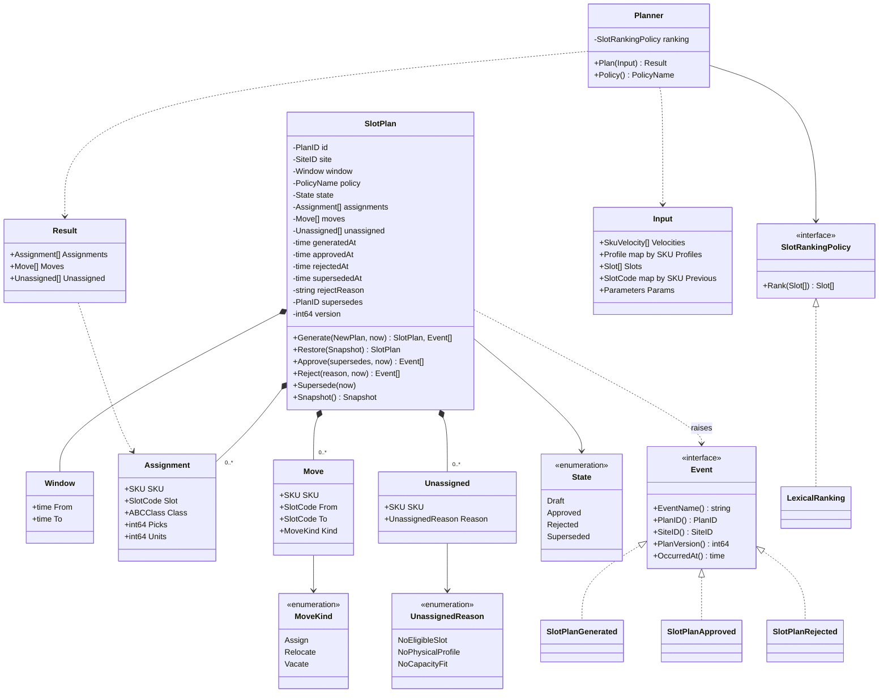

# Class diagrams

UML class diagrams of the domain model and of the hexagonal ports with the
adapters that implement them. Go has no classes: a "class" here is a struct
or a named type, an interface is marked `<<interface>>`, and only the
members that matter for the model are shown.

## Domain: `slotplan` and `planning`

Source: `internal/domain/slotplan/{plan,values,events}.go`,
`internal/domain/planning/planner.go`.

## Ports and adapters

```mermaid
classDiagram
    class SlotPlanRepository {
        <<interface>>
        +Get(ctx, PlanID) SlotPlan
        +Save(ctx, SlotPlan, loadedVersion) error
        +Current(ctx, SiteID) SlotPlan
        +List(ctx, PlanFilter, after, limit) SlotPlan[]
    }
    class DemandLedger {
        <<interface>>
        +Apply(ctx, DemandLine) error
        +Velocity(ctx, SiteID, from, to) SkuVelocity[]
    }
    class ProfileDirectory {
        <<interface>>
        +Get(ctx, SKU) ProductProfile
        +Many(ctx, SKU[]) Profiles
        +Save(ctx, ProductProfile) error
    }
    class SlotCatalogue {
        <<interface>>
        +ForwardSlots(ctx, SiteID, codes) Slot[]
        +SaveZone(ctx, Zone) error
        +SaveSlot(ctx, Slot) error
        +Decommission(ctx, SlotCode) error
    }
    class OutboxRepository {
        <<interface>>
        +Insert(ctx, Message[]) error
    }
    class EventEncoder {
        <<interface>>
        +Encode(Event[]) Message[]
    }
    class ProcessedEvents {
        <<interface>>
        +Claim(ctx, consumer, eventID) bool
    }
    class UnitOfWork {
        <<interface>>
        +Do(ctx, fn) error
    }
    class IDGenerator {
        <<interface>>
        +NewPlanID() PlanID
    }
    class Clock {
        <<interface>>
        +Now() time
    }

    class postgres_SlotPlanRepo
    class postgres_DemandLedger
    class postgres_ProfileDirectory
    class postgres_SlotCatalogue
    class postgres_OutboxRepo
    class postgres_ProcessedEventRepo
    class postgres_UnitOfWork
    class kafka_Encoder
    class ids_UUID
    class clock_System

    SlotPlanRepository <|.. postgres_SlotPlanRepo
    DemandLedger <|.. postgres_DemandLedger
    ProfileDirectory <|.. postgres_ProfileDirectory
    SlotCatalogue <|.. postgres_SlotCatalogue
    OutboxRepository <|.. postgres_OutboxRepo
    ProcessedEvents <|.. postgres_ProcessedEventRepo
    UnitOfWork <|.. postgres_UnitOfWork
    EventEncoder <|.. kafka_Encoder
    IDGenerator <|.. ids_UUID
    Clock <|.. clock_System
```

Source: `internal/application/ports/{ports,unit_of_work,clock}.go`,
`internal/adapters/outbound/postgres/*.go`,
`internal/adapters/outbound/kafka/encoder.go`,
`internal/adapters/outbound/ids/ids.go`,
`internal/adapters/outbound/clock/clock.go`.
Omits: the `memory` package, which implements every repository port with
the same type names (`memory.SlotPlanRepo`, `memory.DemandLedger`,
`memory.ProfileDirectory`, `memory.SlotCatalogue`, `memory.OutboxRepo`,
`memory.ProcessedEventRepo`, `memory.UnitOfWork`) and is wired when
`DATABASE_URL` is unset.

## Inbound adapters and use cases

| Inbound adapter | Calls |
| --- | --- |
| `http.Server` (chi router) | `GeneratePlan`, `ApprovePlan`, `RejectPlan`, `GetPlan`, `ListPlans`, `ListForwardSlots`, `ListSkuVelocity` |
| `kafka.Consumer` "demand consumer" | `ApplyDemandChanged` |
| `kafka.Consumer` "product consumer" | `ApplyProductClassified`, `ApplyPhysicalProfile` |
| `kafka.Consumer` "layout consumer" | `ApplyZoneRegistered`, `ApplyLocationSlotRegistered`, `ApplyLocationSlotDecommissioned` |

The outbox relay (`outbox.Relay`) is driven by its own loop, not by a use
case: it drains `outbox.Store` (`postgres.OutboxRepo` or `memory.OutboxRepo`)
into an `outbox.Sink` (`kafka.RelaySink` or `outbox.LogSink`).
