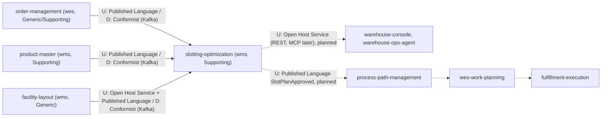

# Context map

This context's slice of the fleet context map, following ddd-crew
[Context Mapping](https://github.com/ddd-crew/context-mapping). U =
upstream, D = downstream. Solid edges exist in code on `develop`; dashed
edges are planned.

Source: `internal/adapters/inbound/kafka/consumer.go` (topics),
`internal/adapters/outbound/kafka/encoder.go`,
`docs/adr/0001-slotting-optimization-bounded-context.md` (context map),
`docs/adr/0003-local-copies-and-consumed-contracts.md`.

## Edges

| Edge | Pattern | Technology | Contract | State |
| --- | --- | --- | --- | --- |
| order-management -> slotting-optimization | Published Language / **Conformist**, local demand copy | Kafka `warehouse.order-management.events`, group `DEMAND_CONSUMER_GROUP` | `SiteSkuDemandChanged` v1 | built (`DEMAND_MODE=kafka`) |
| product-master -> slotting-optimization | Published Language / **Conformist**, local product copy | Kafka `warehouse.product-master.events`, group `PRODUCT_CONSUMER_GROUP` | `ProductClassified`, `ProductDimensionsDeclared`, `ProductMeasured` v1 | built (`PRODUCT_MODE=kafka`) |
| facility-layout -> slotting-optimization | Open Host Service + Published Language / **Conformist**, local slot copy | Kafka `warehouse.facility.events`, group `LAYOUT_CONSUMER_GROUP` | `ZoneRegistered`, `LocationSlotRegistered`, `LocationSlotDecommissioned` v1 | built (`LAYOUT_MODE=kafka`) |
| slotting-optimization -> console, ops-agent | **Open Host Service** | REST (`apis/openapi.yaml`); MCP read tools later | the seven REST operations | API built, no caller yet |
| slotting-optimization -> process-path-management -> wes-work-planning -> fulfillment-execution | Published Language | Kafka `warehouse.slotting-optimization.events` | `SlotPlanApproved` (moves) | **planned, not built** (ADR 0001, ADR 0002) |

## Why Conformist upstream

The three producers own facts this context only reads (demand, product
facts, slot facts). Restating their payloads in local structs
(`siteSkuDemandChangedData`, `productClassifiedData`,
`physicalProfileData`, `zoneRegisteredData`, `locationSlotRegisteredData`,
`locationSlotDecommissionedData`) and acting only on the fields it needs is
cheaper than an anti-corruption layer, and the copies keep the planner
working when a producer is down. The price: a breaking change upstream
breaks the copy, which is why ADR 0003 pins the consumed contracts in
`apis/asyncapi.yaml`.

## No live lookup, in either direction

This context has no outbound HTTP or MCP client, and no sibling calls it at
request time (ADR 0001). Siblings learn about plans only from
`warehouse.slotting-optimization.events`.

## Explicit non-edges

`inventory-storage` (an approved plan moves no stock and does not change
stow), `inbound-receiving` and `warehouse-planning` (ADR 0001).
