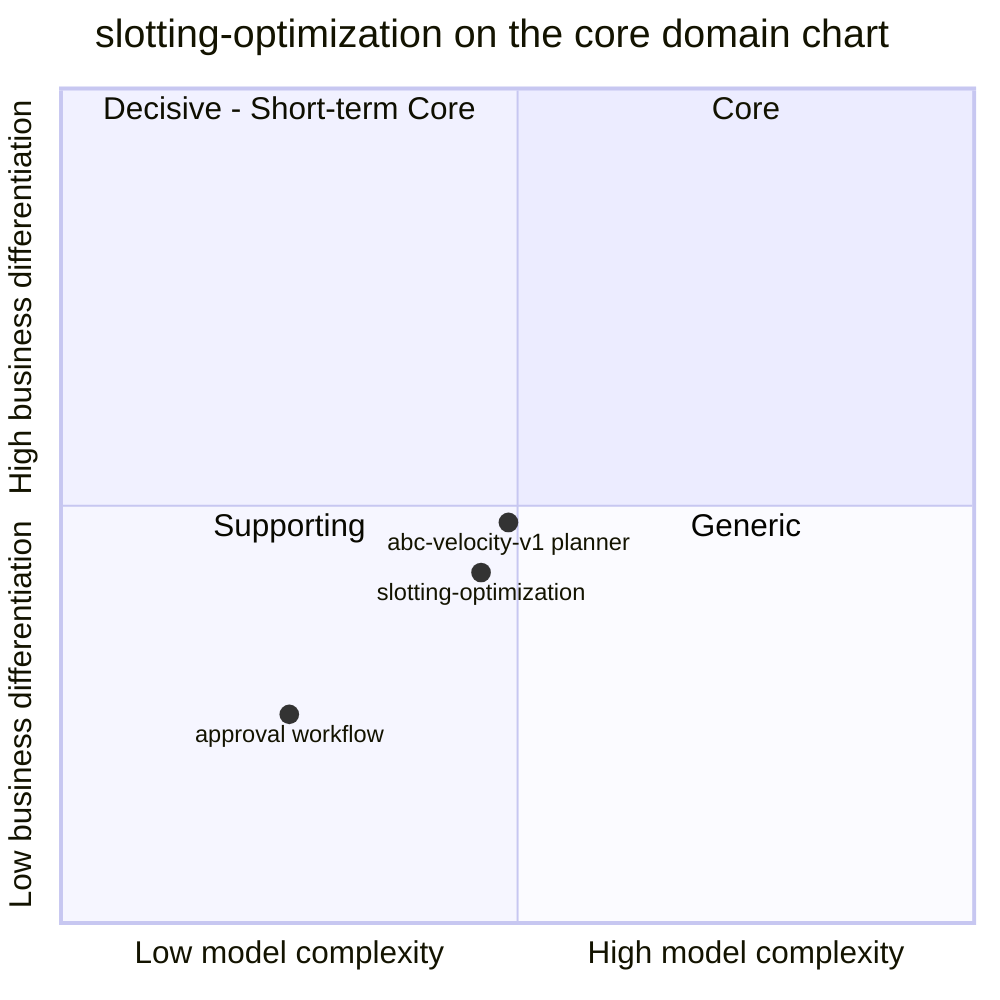

# Core domain chart

Following the ddd-crew [Core Domain Charts](https://github.com/ddd-crew/core-domain-charts):
business differentiation on the vertical axis, model complexity on the
horizontal axis. Mermaid numbers the quadrants 1 = top-right (Core),
2 = top-left, 3 = bottom-left (Supporting), 4 = bottom-right (Generic).

Source: `docs/adr/0001-slotting-optimization-bounded-context.md` (canvas,
strategic classification), `docs/adr/0002-slotplan-aggregate-and-abc-velocity-policy.md`,
`internal/domain/slotplan/*.go`, `internal/domain/planning/planner.go`.
Omits: the sibling contexts (their own charts place them).

## Classification: Supporting

ADR 0001 classifies `slotting-optimization` as a **Supporting subdomain**:
necessary for efficient picking and specific to this warehouse's policy,
but built from replaceable policy objects (ranking, eligibility) rather than
the competitive core, which stays the WES conductor. The context point sits
in the bottom-left quadrant, near its top edge. The warehouse-docs fleet
table agrees ([Subdomain classification](/docs/ddd/subdomain-classification)).

**Business differentiation is moderate-low (y = 0.42).** Slotting reduces
pick travel and labor, which matters, and slotting rules differ per
retailer, so it is not Generic. But every commercial WMS ships slotting as a
standard capability (ADR 0001 cites the 2026 WMS Magic Quadrant), and
nothing in the fleet's promise to customers depends on it today: an
approved plan moves no stock yet.

**Model complexity is moderate (x = 0.46).** Evidence from the code:

- One aggregate (`SlotPlan`) with four states, three events and a strict
  `Restore` that validates every invariant (one SKU per slot, one slot per
  SKU, moves consistent with assignments, unassigned disjoint from
  assignments, one legal combination of decision timestamps per state).
- One cross-aggregate rule, *at most one Approved plan per site*, enforced by
  the use case (supersede first, in the same unit of work) and backed by a
  partial unique index.
- A real computation over sets in a pure domain service: candidate ranking,
  ABC classing by cumulative pick share, eligibility by hazmat, temperature
  and capacity, stickiness, and the move diff (`planning.Planner`).
- Three event-fed local copies with version guards and irreversible
  decommissioning.

The **planner** alone sits at the top-right corner of the Supporting
quadrant (0.49, 0.48): it is where the business rules live and where a
better policy would move the context up. The **approval workflow** (Draft, Approved or Rejected,
Superseded) is plain, commodity-like workflow logic (0.25, 0.25).

## Evolution

**Custom-built, in genesis.** Decided and built on 2026-10-08 (ADRs 0001 to
0004). What would move it: a travel-distance or affinity ranking that
measurably beats the industry standard and that the WES relies on would push
it up towards Core; replacing the planner with a bought engine behind an
anti-corruption layer would push it down to Generic. Replenishment, multi-SKU
slots, reserve-zone slotting and seasonal re-slotting are out of scope for
v1 (ADR 0001).
