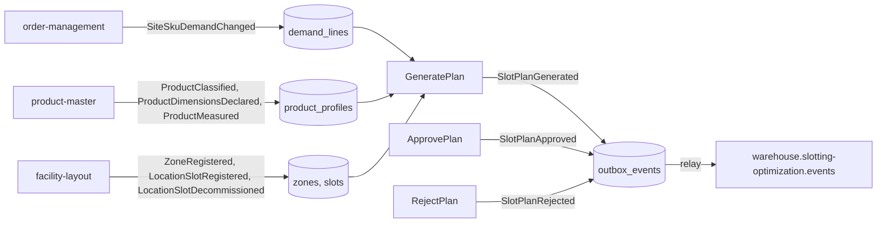

# Domain events

Every event `slotting-optimization` publishes or consumes, with its full
CloudEvents `type`, topic, key and payload. The published payloads are the
structs in `internal/adapters/outbound/kafka/encoder.go`; the consumed ones
are the restated structs in `internal/adapters/inbound/kafka/*_consumer.go`.
Both are pinned in `apis/asyncapi.yaml` (`TestEventCatalogueMatchesContract`).

## Envelope

| Attribute | Value for published events |
| --- | --- |
| `specversion` | `1.0` |
| `id` | UUID v4, minted once at encode time and stored in `outbox_events.event_id`: a resend carries the same id |
| `source` | `/warehouse/slotting-optimization` |
| `type` | `com.warehouse.wms.slotting-optimization.slotplan.<EventName>` |
| `subject` | the plan id |
| `time` | the domain occurred-at (UTC) |
| `datacontenttype` | `application/json` |
| `dataschema` | `urn:warehouse:slotting-optimization:events:<EventName>:v1` |
| Kafka key | the plan id (one plan's events stay ordered on one partition) |
| Kafka header | `content-type: application/cloudevents+json; charset=UTF-8` |

Mode: **structured** (the whole envelope is the Kafka value), built only by
`cloudevents.New`; consumers only accept what `cloudevents.Decode` accepts.

## Published on `warehouse.slotting-optimization.events`

### `SlotPlanGenerated`

`com.warehouse.wms.slotting-optimization.slotplan.SlotPlanGenerated`, raised
by `slotplan.Generate` through `POST /slot-plans`.

| Field | Type | Meaning |
| --- | --- | --- |
| `plan_id` | string | `plan-<uuid>` |
| `site_id` | string | site of the plan |
| `window_from`, `window_to` | RFC 3339 UTC | the demand window |
| `policy` | string | `abc-velocity-v1` |
| `assignment_count`, `move_count`, `unassigned_count` | integer | size of the proposal |

### `SlotPlanApproved`

`com.warehouse.wms.slotting-optimization.slotplan.SlotPlanApproved`, raised
by `SlotPlan.Approve` through `POST /slot-plans/{planId}/approve`. It
carries the **full** map so a consumer needs no lookup.

| Field | Type | Meaning |
| --- | --- | --- |
| `plan_id`, `site_id` | string | |
| `approved_at` | RFC 3339 UTC | |
| `supersedes_plan_id` | string, omitted when none | the site's previous Approved plan, now Superseded |
| `assignments` | array of `{sku, slot}`, never null | the new forward-slot map |
| `moves` | array of `{sku, from_slot?, to_slot?, kind}`, never null | `Assign` (to only), `Relocate` (both), `Vacate` (from only) |

```json
{
  "specversion": "1.0",
  "id": "bfa2833a-...",
  "source": "/warehouse/slotting-optimization",
  "type": "com.warehouse.wms.slotting-optimization.slotplan.SlotPlanApproved",
  "subject": "plan-ee0b77f6-...",
  "time": "2026-10-09T11:50:02Z",
  "datacontenttype": "application/json",
  "dataschema": "urn:warehouse:slotting-optimization:events:SlotPlanApproved:v1",
  "data": {
    "plan_id": "plan-ee0b77f6-...",
    "site_id": "WH1",
    "approved_at": "2026-10-09T11:50:02Z",
    "assignments": [{"sku": "SKU-A", "slot": "FWD-01-01"}, {"sku": "SKU-B", "slot": "FWD-01-02"}],
    "moves": [{"sku": "SKU-A", "to_slot": "FWD-01-01", "kind": "Assign"}, {"sku": "SKU-B", "to_slot": "FWD-01-02", "kind": "Assign"}]
  }
}
```

(Illustrative values in the shape `encoder.go` produces; ids shortened.)

### `SlotPlanRejected`

`com.warehouse.wms.slotting-optimization.slotplan.SlotPlanRejected`, raised
by `SlotPlan.Reject` through `POST /slot-plans/{planId}/reject`.

| Field | Type | Meaning |
| --- | --- | --- |
| `plan_id`, `site_id` | string | |
| `rejected_at` | RFC 3339 UTC | |
| `reason` | string, omitted when empty | trimmed, at most 500 characters |

`Supersede` raises **no** event: consumers learn it from
`supersedes_plan_id` on the newer `SlotPlanApproved`.

**Consumers:** none on `develop`. The planned execution path
(process-path-management, then wes-work-planning and fulfillment-execution)
is not built ([Integration](/docs/ecosystem/integration#downstream)).

## Consumed

| Type | Topic | Producer | Fields acted on | Use case |
| --- | --- | --- | --- | --- |
| `com.warehouse.wes.order-management.siteskudemand.SiteSkuDemandChanged` | `warehouse.order-management.events` | order-management | `source_order_id`, `line_no`, `site_id`, `sku`, `demanded_units`, `due_at`, `state` (`assignment_version` is decoded and ignored) | `ApplyDemandChanged` |
| `com.warehouse.wms.product-master.product.ProductClassified` | `warehouse.product-master.events` | product-master | `sku`, `handling_tags`, `temperature_class`, `version` | `ApplyProductClassified` |
| `com.warehouse.wms.product-master.product.ProductDimensionsDeclared` | `warehouse.product-master.events` | product-master | `sku`, `effective.volume_mm3`, `effective.weight_g`, `effective_source`, `version` | `ApplyPhysicalProfile` |
| `com.warehouse.wms.product-master.product.ProductMeasured` | `warehouse.product-master.events` | product-master | same as above | `ApplyPhysicalProfile` |
| `com.warehouse.wms.facility-layout.zone.ZoneRegistered` | `warehouse.facility.events` | facility-layout | `zoneId`, `siteCode`, `areaCode`, `zoneCode`, `temperatureClass`, `hazmat` | `ApplyZoneRegistered` |
| `com.warehouse.wms.facility-layout.locationslot.LocationSlotRegistered` | `warehouse.facility.events` | facility-layout | `locationCode`, `zoneId`, `role`, `maxWeightKg`, `maxVolumeM3` (`aisleId`, `locationType`, `dockFlow`, `activities` ignored) | `ApplyLocationSlotRegistered` |
| `com.warehouse.wms.facility-layout.locationslot.LocationSlotDecommissioned` | `warehouse.facility.events` | facility-layout | `locationCode` | `ApplyLocationSlotDecommissioned` |

Dispatch is on the full `type` string; every other type on those topics is
ignored. Note the casing: order-management and product-master payloads are
snake_case, facility-layout payloads are camelCase, exactly as each producer
publishes them.

## Event flow



Source: `internal/adapters/inbound/kafka/*_consumer.go`,
`internal/application/usecases/*.go`,
`internal/adapters/outbound/kafka/encoder.go`.
