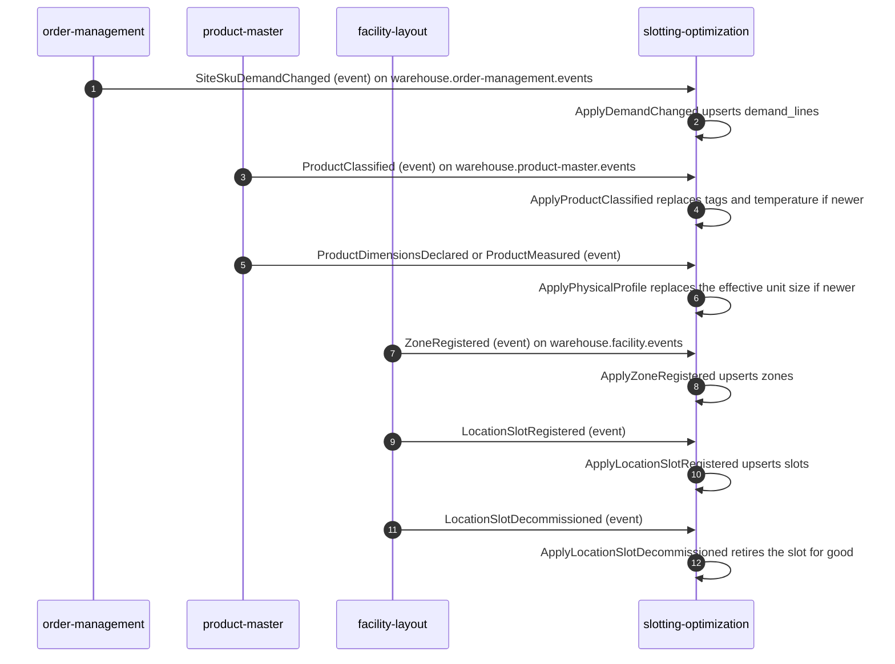
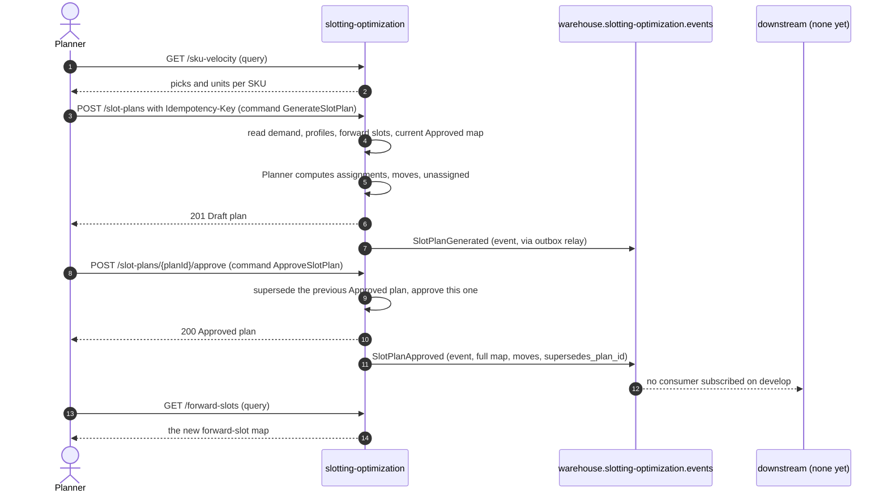
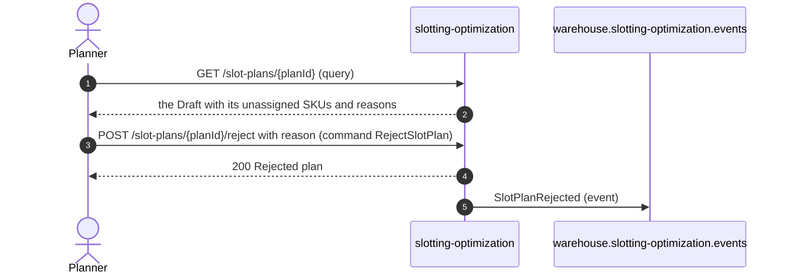

# Domain message flow

The key business scenarios as numbered command / event / query flows,
following ddd-crew
[Domain Message Flow Modelling](https://github.com/ddd-crew/domain-message-flow-modelling).
Messages are labelled *(command)*, *(event)* or *(query)*. Only edges that
exist in code are solid.

## 1. Keep the local copies current

Source: `internal/adapters/inbound/kafka/{demand,product,layout}_consumer.go`,
`internal/application/usecases/consumers.go`.

## 2. Generate a plan and approve it

Source: `internal/application/usecases/generate_plan.go`,
`internal/application/usecases/decide_plan.go`,
`internal/adapters/outbound/outbox/relay.go`.

## 3. Reject a plan

Source: `internal/application/usecases/decide_plan.go` (`RejectPlan`).

## 4. Planned: execute the moves

Not built. ADR 0001 and ADR 0002 describe the intended path: a consumer in
`process-path-management` (or the WES) turns the moves of
`SlotPlanApproved` into MOVE / REPLENISH work for `wes-work-planning` and
`fulfillment-execution`. It needs ADRs in those contexts and a new task
type, so no diagram is drawn here as if it existed.
