# Entity-relationship diagram

The OLTP schema created by the single migration
`internal/adapters/outbound/postgres/migrations/0001_slotting_schema.up.sql`,
applied at boot (see [Runbook](/docs/operations/runbook#migrations)). Text
keys compared or ordered in Go (plan ids, SKUs, slot codes) use the `"C"`
collation so database order equals the in-memory adapters' byte order.

```mermaid
erDiagram
    slot_plans ||--o{ slot_plan_assignments : "assigns"
    slot_plans ||--o{ slot_plan_moves : "implies"
    slot_plans ||--o{ slot_plan_unassigned : "could not place"
    zones ||--o{ slots : "zone_id (no FK)"

    slot_plans {
        text plan_id PK
        text site_id
        text state "Draft, Approved, Rejected, Superseded"
        text policy
        timestamptz window_from
        timestamptz window_to
        timestamptz generated_at
        timestamptz approved_at
        timestamptz rejected_at
        timestamptz superseded_at
        text reject_reason
        text supersedes_plan_id
        bigint version "at least 1"
        timestamptz created_at
        timestamptz updated_at
    }
    slot_plan_assignments {
        text plan_id PK, FK
        text sku PK
        text slot "unique per plan"
        text abc_class "A, B, C"
        bigint picks "at least 1"
        bigint units "at least 0"
    }
    slot_plan_moves {
        text plan_id PK, FK
        text sku PK
        text from_slot
        text to_slot
        text kind "Assign, Relocate, Vacate"
    }
    slot_plan_unassigned {
        text plan_id PK, FK
        text sku PK
        text reason "NoEligibleSlot, NoPhysicalProfile, NoCapacityFit"
    }
    demand_lines {
        text source_order_id PK
        integer line_no PK
        text site_id
        text sku
        bigint units
        timestamptz due_at
        text state "ACTIVE, REMOVED"
        timestamptz updated_at
    }
    product_profiles {
        text sku PK
        text_array handling_tags
        text temperature_class
        bigint volume_mm3 "null together with weight_g"
        bigint weight_g
        bigint version
        timestamptz updated_at
    }
    zones {
        text zone_id PK
        text site_code
        text area_code
        text zone_code
        text temperature_class
        boolean hazmat
        timestamptz updated_at
    }
    slots {
        text location_code PK
        text zone_id
        text role "default Storage"
        boolean active "false = decommissioned for good"
        double max_weight_kg
        double max_volume_m3
        timestamptz updated_at
    }
    outbox_events {
        bigserial id PK
        text event_id "unique with topic"
        text topic
        text event_type
        text subject
        bytea key
        text dataschema
        bytea value
        jsonb headers
        timestamptz created_at
        timestamptz published_at
        integer attempts
        text last_error
    }
    processed_events {
        text consumer PK
        text event_id PK
        timestamptz processed_at
    }
    idempotency_keys {
        text key PK
        text method
        text path
        text request_hash
        integer status_code
        bytea response_body
        jsonb response_headers
        timestamptz created_at
        timestamptz completed_at
    }
```

Source: `internal/adapters/outbound/postgres/migrations/0001_slotting_schema.up.sql`.

## Which table backs what

| Table | Backs | Written by | Read by |
| --- | --- | --- | --- |
| `slot_plans` | the `SlotPlan` aggregate root | `SlotPlanRepo.Save` (insert at version 1, then `UPDATE ... WHERE version = loaded`) | every plan query, `Current` (the site's Approved plan) |
| `slot_plan_assignments`, `slot_plan_moves`, `slot_plan_unassigned` | the plan's content, written once with the plan, `ON DELETE CASCADE` | `SlotPlanRepo.Save` on insert | plan reads, `GET /forward-slots` |
| `demand_lines` | the demand copy | `ApplyDemandChanged` (upsert by order and line) | `DemandLedger.Velocity` |
| `product_profiles` | the product copy | `ApplyProductClassified`, `ApplyPhysicalProfile` (upsert `WHERE version <` new) | `ProfileDirectory.Many` |
| `zones`, `slots` | the layout copy | `ApplyZoneRegistered`, `ApplyLocationSlotRegistered` (upsert `WHERE slots.active`), `ApplyLocationSlotDecommissioned` | `SlotCatalogue.ForwardSlots` (join on `zone_id`) |
| `outbox_events` | the transactional outbox | every write use case, in its unit of work | the relay (`FOR UPDATE SKIP LOCKED`) |
| `processed_events` | consumer idempotency | every consumer use case, in its unit of work | the same claim |
| `idempotency_keys` | REST idempotency of `POST /slot-plans` | the middleware, in the same transaction as the use case | the middleware on a repeated key |

## Indexes and constraints that carry rules

| Object | Rule |
| --- | --- |
| `uq_slot_plans_one_approved_per_site` (unique on `site_id` where `state = 'Approved'`) | at most one Approved plan per site; the losing approval of a race becomes `409 approved-plan-conflict` |
| `idx_slot_plans_listing` (`generated_at DESC, plan_id DESC`) | keyset paging of `GET /slot-plans` |
| `idx_slot_plans_site_state` | `Current` and the state filter |
| `UNIQUE (plan_id, slot)` on assignments | one SKU per slot within a plan |
| `CHECK (window_from < window_to)` and the state / class / kind / reason checks | the domain enums mirrored in the database |
| `idx_demand_lines_site_due_active` (partial, `state = 'ACTIVE'`), `idx_demand_lines_sku_due` | the velocity query |
| `CHECK ((volume_mm3 IS NULL) = (weight_g IS NULL))` | a unit size is both dimensions or none |
| `idx_zones_site_zone_code`, `idx_slots_zone` (partial, `active`) | the forward-slot join |
| `outbox_events_event_id_topic_key` (unique `event_id, topic`) | one row per CloudEvent per topic |
| `idx_outbox_events_unpublished` (partial, `published_at IS NULL`) | the relay scans only the unpublished tail |
| `idx_idempotency_keys_created_at` | age-based cleanup ([Runbook](/docs/operations/runbook#housekeeping)) |

`slots.zone_id` has no foreign key on purpose: zone and slot events may
arrive in any order, and the join happens at plan time.
