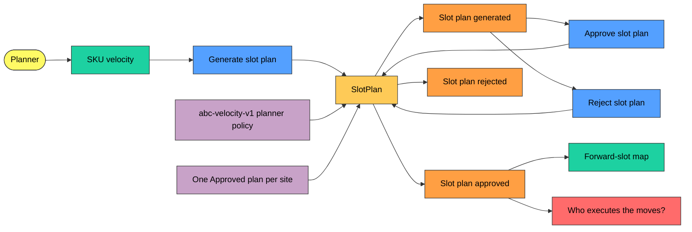
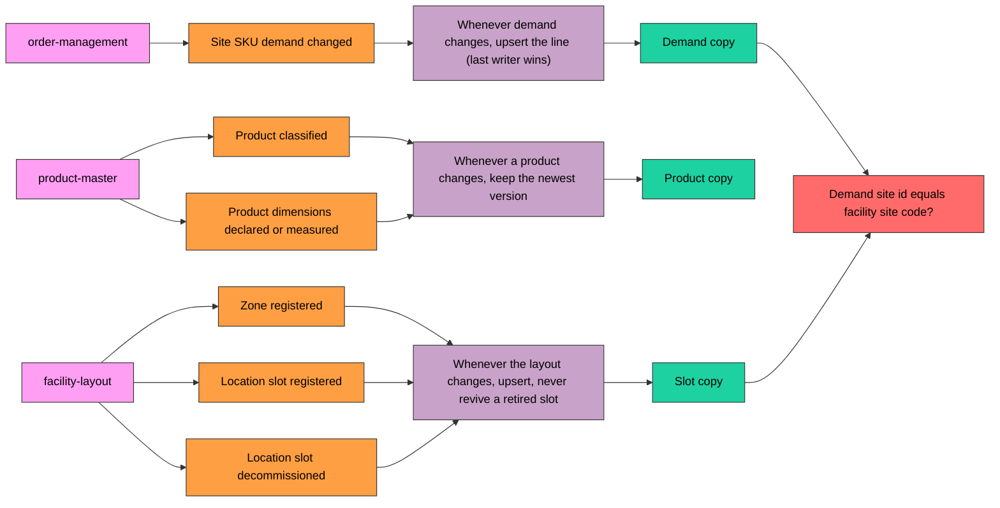

# EventStorming

A design-level EventStorming of `slotting-optimization`, using the sticky
colours of the ddd-crew
[EventStorming glossary and cheat sheet](https://github.com/ddd-crew/eventstorming-glossary-cheat-sheet):
**orange** domain event, **blue** command, **yellow** aggregate, **lilac**
policy, **green** read model, **pink** external system, **red** hotspot,
small yellow actor.

## Planning flow

Source: `internal/application/usecases/{generate_plan,decide_plan,queries}.go`,
`internal/domain/slotplan/plan.go`, `internal/domain/planning/planner.go`.

## Local-copy flow

Source: `internal/application/usecases/consumers.go`,
`internal/adapters/outbound/postgres/read_models.go`.

## Hotspots

| Hotspot | Why it is open | Where it shows |
| --- | --- | --- |
| Who executes the moves? | `SlotPlanApproved` carries the moves, but no context consumes it; the execution path through process-path-management is planned only (ADR 0001, ADR 0002) | an approved plan changes nothing on the floor |
| Demand site id equals facility site code? | `ForwardSlots` joins `zones.site_code` to the plan's site, which comes from demand `site_id`; ADR 0003 calls for verifying this against live data | a mismatch makes every SKU `NoEligibleSlot` |
| Lexical slot ranking | layout events carry no travel distance, so v1 ranks slots by location code; `LocationGeometryUpdated` is ignored | "best" slot means "first code", not "closest" |
| No consumer, no Kong route, no chart | the service is built but not wired into the cluster | [Runbook](/docs/operations/runbook#deployment) |
