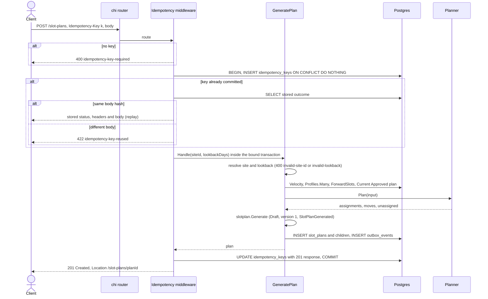
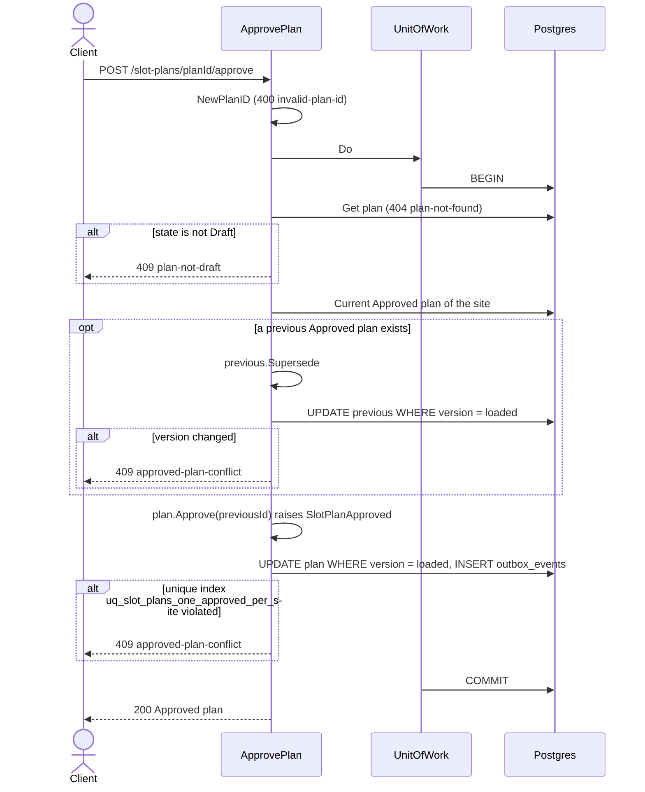
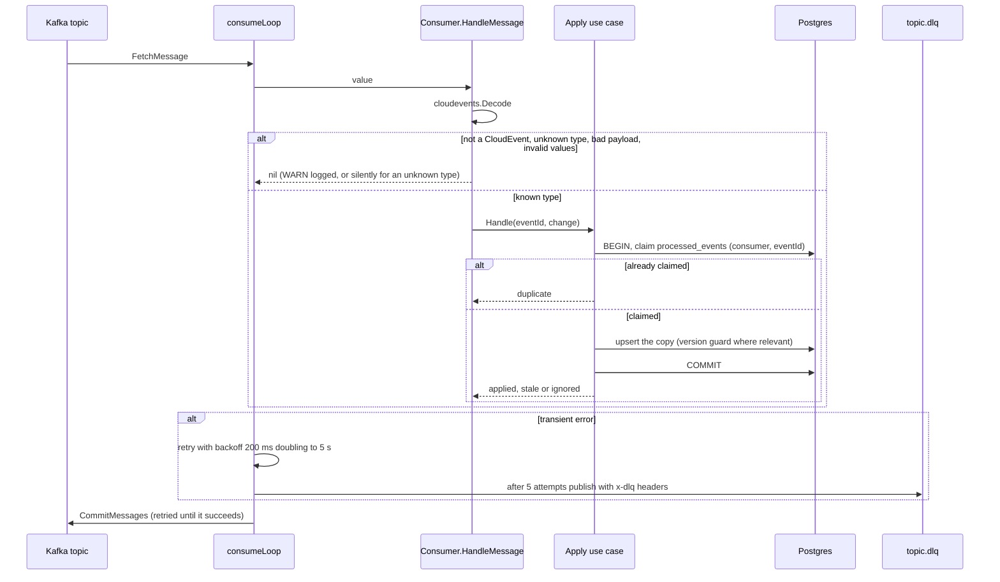
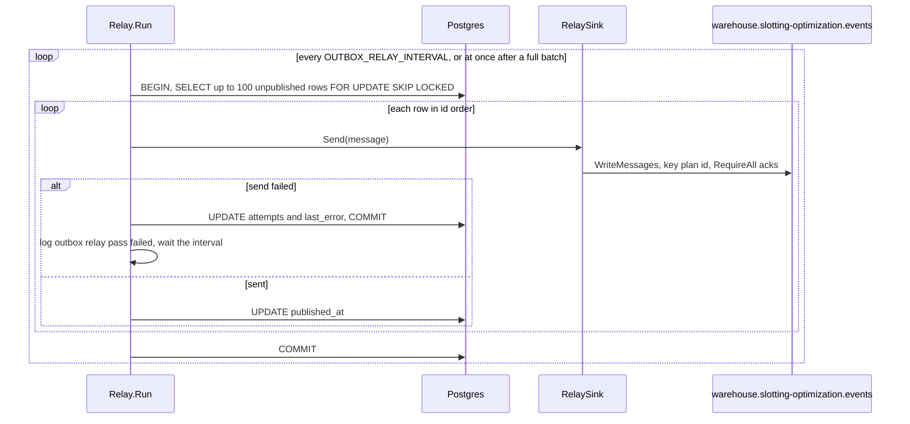

# Sequence diagrams

The main runtime interactions inside `cmd/api`, drawn from the code with
their error branches. Postgres mode (`DATABASE_URL` set) is shown; the
in-memory mode is the same without the idempotency middleware.

## Generate a plan

Source: `internal/adapters/inbound/http/idempotency.go`,
`internal/adapters/inbound/http/handlers.go`,
`internal/application/usecases/generate_plan.go`.

A 5xx from the handler rolls the whole transaction back and is not cached,
so the same key can retry.

## Approve a plan

Source: `internal/application/usecases/decide_plan.go`,
`internal/adapters/outbound/postgres/slot_plan_repository.go`.

Reject follows the same shape without the supersede step: `Get`,
`plan.Reject(reason)` (`409 plan-not-draft`, `400 reject-reason-too-long`),
`UPDATE ... WHERE version = loaded`, outbox insert, commit.

## Consume one message

Source: `internal/adapters/inbound/kafka/{kafka,consumer,deadletter}.go`,
`internal/application/usecases/consumers.go`.

## Relay the outbox

Source: `internal/adapters/outbound/outbox/relay.go`,
`internal/adapters/outbound/postgres/outbox_repository.go`,
`internal/adapters/outbound/kafka/relay_sink.go`.
