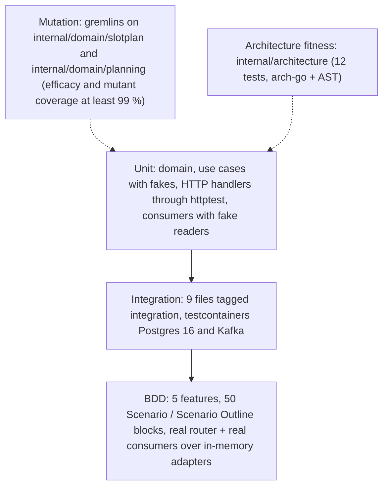

# Testing

The test pyramid as it exists on `develop`, the `make` targets that run each
layer, and the CI jobs that gate a pull request. Every count on this page
was taken from the repository on 2026-10-09.

Source: `Makefile`, `.github/workflows/ci.yml`, `features/*.feature`,
`.gremlins.yaml`, `internal/architecture/*_test.go`.

## Make targets

| Target | Command | Needs | In `check` / `check-all` |
| --- | --- | --- | --- |
| `make test` | `go test ./... -race` | nothing (no database, no broker) | both |
| `make coverage` | `go test ./... -race -coverprofile=coverage.out -coverpkg=./internal/domain/...,./internal/application/...` plus the 90 % gate | nothing | `check-all` |
| `make bdd` | `go test ./... -run TestFeatures -v` | nothing | `check-all` |
| `make arch-test` | `go test ./internal/architecture/... -v` | nothing | `check-all` |
| `make integration` | `go test -tags=integration ./... -race -count=1` | Docker only | neither |
| `make mutation` | `gremlins unleash` on `./internal/domain/slotplan`, then `./internal/domain/planning` | gremlins `v0.6.0` | neither |
| `make mutation-full` | `gremlins unleash ./internal/domain --workers 1 --timeout-coefficient 30` | gremlins | neither |
| `make lint` | `golangci-lint run ./...` (complexity limits in `.golangci.yml`) | golangci-lint `v2.14.0` | both |
| `make vuln` | `govulncheck ./...` | govulncheck | neither |
| `make check` | `fmt-check vet build lint test` | | the pre-commit gate |
| `make check-all` | `check coverage arch-test bdd` | | run before pushing |
| `make check-fast` | `fmt-check vet arch-test` plus the tests of the Go packages changed vs `HEAD` | python3 | the agent Stop hook |

lefthook (`lefthook.yml`) runs `fmt-check`, `vet` and `lint` on commit and
`make check` on push.

## Unit tests

Plain `go test`, no build tag, no I/O.

| Area | Where | What it pins |
| --- | --- | --- |
| Aggregate | `internal/domain/slotplan/{plan,values}_test.go` | every invariant of `Restore`, the `Draft -> Approved/Rejected`, `Approved -> Superseded` transitions, the events and their headers |
| Planner | `internal/domain/planning/planner_test.go` | candidates, ABC thresholds, hazmat and temperature compatibility, capacity, stickiness, move diffing, determinism |
| Use cases | `internal/application/usecases/*_test.go` with `fakes_test.go` | unit-of-work boundaries, version guards, supersede-on-approve, consumer outcomes (`applied`, `duplicate`, `stale`, `ignored`) |
| HTTP | `internal/adapters/inbound/http/*_test.go` (not `_integration`) | routes through `httptest`, problem mapping, readiness |
| Kafka in | `internal/adapters/inbound/kafka/*_test.go` | dispatch by full `type`, skip vs retry, backoff sequence, dead-lettering with fake readers and writers |
| Kafka out, relay | `internal/adapters/outbound/{kafka,outbox}/*_test.go` | CloudEvents encoding (golden), sink settings, relay batching |
| In-memory adapters | `internal/adapters/outbound/memory/memory_test.go` | the shared repository contract in `internal/testing/repocontract` |
| Composition root | `cmd/api/main_test.go` | env parsing (publisher and consumer modes, relay interval, `LOOKBACK_DAYS`, `FORWARD_ZONE_CODES`, `DEMAND_SITE_ID`/`DEFAULT_SITE_ID`, drain delay, `MIGRATIONS_DATABASE_URL`), boot refusals, consumers and relay start and stop, an in-memory end-to-end run |
| Boot retry, telemetry, ids, clock | their packages | |

## Integration tests (testcontainers)

Nine files carry `//go:build integration`:

| Package | Files | Backing services |
| --- | --- | --- |
| `internal/adapters/outbound/postgres` | `main_integration_test.go`, `repositories_integration_test.go` | Postgres: the same `repocontract` suite the memory adapters pass (`TestSlotPlanRepoContract`, `TestDemandLedgerContract`, `TestProfileDirectoryContract`, `TestSlotCatalogueContract`), one Approved plan per site enforced by the database, the unit of work committing or rolling back plan, outbox and claim together, claim-once, outbox drain order and failure handling |
| `internal/adapters/outbound/outbox` | `main_integration_test.go`, `relay_integration_test.go` | Postgres + Kafka: `TestRelay_RealPostgresAndKafka_PublishesCloudEventsKeyedByPlanID` |
| `internal/adapters/inbound/http` | `main_integration_test.go`, `helpers_integration_test.go`, `idempotency_integration_test.go` | Postgres: the `Idempotency-Key` middleware (400 without a key, replay of the original plan, 422 on a different body, different keys make different plans, a rejected request is cached too, concurrent requests with one key create one plan), approve end to end, racing approvals of one site leave one Approved plan |
| `internal/adapters/inbound/kafka` | `main_integration_test.go`, `consumers_integration_test.go` | Postgres + Kafka: the demand, product and layout consumers end to end |

`internal/testing/pgtest` starts one `postgres:16-alpine` container per test
binary and clones a migrated template database per test;
`internal/testing/kafkatest` starts `confluentinc/confluent-local:7.6.1`.
Neither reads `DATABASE_URL` or `KAFKA_BROKERS` and neither skips: no Docker
is a failure. Two fitness tests keep it that way
(`TestPostgresIntegrationTestsUseTestcontainers`,
`TestKafkaIntegrationTestsUseTestcontainers`).

## BDD (godog)

`features_test.go` (`TestFeatures`) and `features_wave2_test.go` drive the
real chi router over HTTP and feed the local copies through the real
consumers' `HandleMessage` with raw CloudEvents, over the in-memory adapters
wired the way `cmd/api` wires them, with a fixed clock (2026-10-08 12:00 UTC)
and sequential plan ids. Strict mode: an undefined step fails.

| Feature file | Scenario / Scenario Outline blocks |
| --- | --- |
| `features/generate_plan.feature` | 9 |
| `features/generate_plan_request.feature` | 6 |
| `features/approve_and_reject.feature` | 10 |
| `features/plan_decisions_and_events.feature` | 20 |
| `features/velocity_and_listing.feature` | 5 |
| **Total** | **50** (7 of them are outlines with example tables) |

## Mutation testing

`.gremlins.yaml`: `workers: 1`, `timeout-coefficient: 30`, thresholds
`efficacy: 99` and `mutant-coverage: 99` (gremlins fails at or below the
threshold). Measured on 2026-10-08: `internal/domain/slotplan` 72 killed / 0
lived, `internal/domain/planning` 46 killed / 0 lived, both 100 %.

## Architecture fitness tests

`internal/architecture` (`make arch-test`, CI job `arch-test`):

| Test | Rule |
| --- | --- |
| `TestHexagonalArchitecture` | domain imports nothing from application or adapters; `ports` holds interfaces only; adapters never import each other (arch-go) |
| `TestMCPAdapterDependencyRule` | an MCP adapter, if one is ever added, depends only on the application and domain layers and nothing imports it (no MCP adapter exists on `develop`) |
| `TestNoAuthMiddlewareReintroduced` | no auth middleware on the router (fleet decision) |
| `TestKafkaConsumerGroupNeverHardcodedInline` | group ids come from the environment |
| `TestKafkaIntegrationTestsUseTestcontainers`, `TestPostgresIntegrationTestsUseTestcontainers`, `TestPostgresIntegrationSensorFailsOnBadFixtures` | integration tests boot real containers and never skip |
| `TestNoEventEnvelopeToggleOrFlatEnvelope`, `TestCloudEventsOnly` | CloudEvents 1.0 only, built in one package |
| `TestReplayConsumersSetCommitInterval` | a reader whose `GroupID` is a per-run unique group must set `CommitInterval` (no such reader exists here; the three consumers use env-provided groups and synchronous commits) |
| `TestEventCatalogueMatchesContract`, `TestEventCatalogueDetector` | the published types match `apis/asyncapi.yaml` |

## Contract and API checks

There is no schemathesis (or other runtime contract) job in this repository.
The contracts are checked statically: the `api-lint` job runs Spectral on
`apis/openapi.yaml` (`.spectral.yaml`) and `apis/asyncapi.yaml`
(`.spectral.asyncapi.yaml`) with `--fail-severity=warn`, and the CloudEvents
golden tests plus `TestEventCatalogueMatchesContract` tie the encoder to the
AsyncAPI document.

## Evals

`EVALS.md` records the harness evaluations (`tools/harness_eval.py`,
`tools/harness_eval2.py`): agent runs against inventory-storage and
fulfillment-execution comparing guided and unguided agents. They are not
tests of this service and do not run in CI.

## CI

`.github/workflows/ci.yml` (on push to `main`/`develop`, every pull request
into them, weekly schedule, manual dispatch):

| Job | Runs | On a PR into `develop` |
| --- | --- | --- |
| `lint` | golangci-lint `v2.14.0` | blocking |
| `guide-lint` | `scripts/harness/guide_lint.py` and `test_hook.py` | advisory (`continue-on-error`) |
| `complexity` | golangci-lint with only `gocyclo,gocognit,cyclop,funlen,nestif`, plus an informational gocyclo report | blocking |
| `test` | `go build`, `go vet`, `go test ./... -race` with coverage over domain and application, 90 % gate | blocking |
| `bdd` | `go test ./... -run TestFeatures -v` | blocking |
| `integration` | `go test -tags=integration ./... -race -count=1` (testcontainers on the runner's Docker) | blocking |
| `mutation-fast` | gremlins on `slotplan` and `planning` | blocking |
| `mutation` | gremlins on `./internal/domain` | skipped (schedule and dispatch only); opens or closes a `harness:red` issue |
| `drift` | deadcode, `go mod tidy -diff`, coverage-quality report | skipped (schedule and dispatch only), advisory |
| `api-lint` | Spectral on both specs | blocking |
| `vuln` | `govulncheck ./...` | blocking |
| `arch-test` | `go test ./internal/architecture/... -v` | blocking |
| `docker-publish`, `release` | image, signature, SBOM, Helm chart, GitHub release | skipped (push to `main` only) |

Other workflows: `docs.yml` builds this site on every pull request touching
`docs/**` or `apis/**` and deploys GitHub Pages from `main`; `selftest.yml`
runs the harness template's own checks (hook tests, `repo_lint` tests,
Python compile, the architecture tests, the migration tool); `ai-review.yml`
is the automated review workflow.
