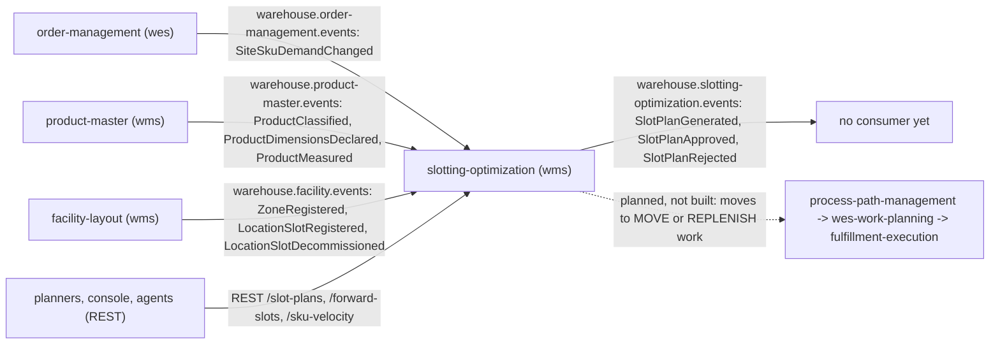

# Integration

Every edge between `slotting-optimization` and the rest of the fleet, as the
code on `develop` builds it. The service has **no outbound HTTP or MCP
client**: it never calls a sibling. Everything it knows about demand,
products and slots arrives on Kafka and is kept in local copies
(ADR 0003); everything it decides leaves on Kafka through the transactional
outbox (ADR 0004).

Source: `internal/adapters/inbound/kafka/{demand,product,layout}_consumer.go`,
`internal/adapters/outbound/kafka/encoder.go`,
`internal/adapters/inbound/http/server.go`, ADR 0001 (context map).

## Upstream

All three are **Conformist** edges over the producer's Published Language:
the payloads are restated in Go structs (never imported) and in
`apis/asyncapi.yaml`, and the full CloudEvents `type` string is the dispatch
key. Each producer was checked on its own `origin/develop` on 2026-10-09:
the topic constant and the type strings below exist in its code.

| Producer | Topic | Type consumed | Fields read | Effect here |
| --- | --- | --- | --- | --- |
| `order-management` | `warehouse.order-management.events` | `com.warehouse.wes.order-management.siteskudemand.SiteSkuDemandChanged` | `source_order_id`, `line_no`, `site_id`, `sku`, `demanded_units`, `due_at`, `state` (`ACTIVE` or `REMOVED`) | upsert of `demand_lines` by `(source_order_id, line_no)`, last writer wins; dropped when `DEMAND_SITE_ID` names another site |
| `product-master` | `warehouse.product-master.events` | `com.warehouse.wms.product-master.product.ProductClassified` | `sku`, `handling_tags`, `temperature_class`, `version` | replaces the classification in `product_profiles` if `version` is newer |
| `product-master` | same | `com.warehouse.wms.product-master.product.ProductDimensionsDeclared`, `com.warehouse.wms.product-master.product.ProductMeasured` | `sku`, `effective.volume_mm3`, `effective.weight_g`, `effective_source`, `version` | replaces the effective unit size if `version` is newer; `effective_source = none` clears it |
| `facility-layout` | `warehouse.facility.events` | `com.warehouse.wms.facility-layout.zone.ZoneRegistered` | `zoneId`, `siteCode`, `areaCode`, `zoneCode`, `temperatureClass`, `hazmat` | upsert of `zones` |
| `facility-layout` | same | `com.warehouse.wms.facility-layout.locationslot.LocationSlotRegistered` | `locationCode`, `zoneId`, `role` (empty means `Storage`), `maxWeightKg`, `maxVolumeM3` | upsert of `slots` unless the slot was decommissioned |
| `facility-layout` | same | `com.warehouse.wms.facility-layout.locationslot.LocationSlotDecommissioned` | `locationCode` | `slots.active = false`, for good |

Every other type on those topics (for example `FacilityLayoutImported` or
`LocationGeometryUpdated` on the facility topic) is ignored.

### Failure behaviour (inbound)

| Situation | Behaviour |
| --- | --- |
| Producer down or silent | nothing breaks; the copy goes stale and the next plan is computed from what it holds. Plans list unplaceable SKUs with a reason instead of guessing. |
| Broker down | the readers retry inside kafka-go; boot is not blocked. |
| Message is not CloudEvents 1.0, payload malformed, values invalid | logged at WARN and committed past (never retried, never dead-lettered) |
| Transient failure (Postgres) | same message retried with backoff, 5 attempts, then `<topic>.dlq` |
| Redelivery | `processed_events` claim makes it a no-op (`outcome=duplicate`) |
| Out-of-order product events | the `version` guard keeps the newest (`outcome=stale`) |
| Consumer not enabled (`*_MODE=permissive`, the default) | the copy is whatever the database already holds |

## Downstream

| Consumer | Protocol | Contract | State on `develop` |
| --- | --- | --- | --- |
| any subscriber of `warehouse.slotting-optimization.events` | Kafka, CloudEvents 1.0 structured mode, key = plan id | `com.warehouse.wms.slotting-optimization.slotplan.SlotPlanGenerated`, `...SlotPlanApproved` (full `{sku, slot}` map, the moves, `supersedes_plan_id`), `...SlotPlanRejected`; dataschema `urn:warehouse:slotting-optimization:events:<EventName>:v1` ([Domain events](/docs/ddd/domain-events)) | **no consumer exists**: a search of `warehouse-ops-agent`, `warehouse-console` and `wes-work-planning` on `origin/develop` finds none |
| planners, `warehouse-console`, `warehouse-ops-agent` | REST (Open Host Service), unauthenticated | `apis/openapi.yaml`: `POST /slot-plans`, `GET /slot-plans`, `GET /slot-plans/{planId}`, `POST /slot-plans/{planId}/approve`, `POST /slot-plans/{planId}/reject`, `GET /forward-slots`, `GET /sku-velocity` | the API is built; no console remote and no agent tool call it yet. `CORS_ALLOWED_ORIGINS` defaults to the console's dev origin `http://localhost:5173`. |
| `process-path-management`, `wes-work-planning`, `fulfillment-execution` | Kafka | turn the moves of `SlotPlanApproved` into MOVE / REPLENISH work | **planned, not built** (ADR 0001, ADR 0002): needs ADRs in those contexts and a new task type |
| MCP clients | MCP (Streamable HTTP) | read tools | **planned** (ADR 0001); there is no `cmd/mcp` |

### Failure behaviour (outbound)

The plan row and its outbox rows commit in one transaction, so a decision is
never lost and never published without being stored. A broker outage only
delays publication: the relay retries every `OUTBOX_RELAY_INTERVAL`, in id
order, with the original CloudEvents ids, and stops at the first failing
row so per-plan order holds. With `EVENT_PUBLISHER=log` (the default) the
events are only logged; downstream sees nothing.

## Explicit non-edges

- **No edge to `inventory-storage`**: an approved plan moves no stock and
  does not change stow behaviour (ADR 0001).
- **No edge to `inbound-receiving` or `warehouse-planning`.**
- **No request-time calls** in either direction: no sibling calls this
  service, and it calls none.

## Edge and infrastructure

The fleet edge (Kong `:8000`, `/api/<context>`) has no route for this
context yet, and there is no Helm chart; see
[Runbook](/docs/operations/runbook#deployment).
