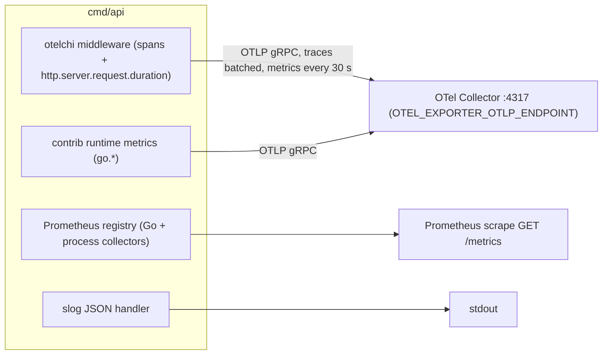

# Observability

`slotting-optimization` emits three signals: OpenTelemetry traces and
metrics pushed over OTLP/gRPC, a Prometheus scrape endpoint for runtime
metrics, and JSON logs on stdout. It defines **no business metric of its
own** on `develop`: there is no `metric.WithDescription` call and no
custom tracer in `internal/`. Everything below comes from the libraries the
composition root installs.

## Pipeline



Source: `internal/adapters/outbound/telemetry/telemetry.go`,
`internal/adapters/outbound/telemetry/metrics.go`,
`internal/adapters/inbound/http/server.go`, `cmd/api/main.go` (`newLogger`).

| Setting | Value | Source |
| --- | --- | --- |
| Exporter | OTLP/gRPC, insecure, to `OTEL_EXPORTER_OTLP_ENDPOINT` (default `localhost:4317`) for traces and metrics | `telemetry.Setup` |
| Connection | lazy and non-blocking: no Collector means spans and metrics are dropped, the service still starts | `telemetry.Setup` |
| Metric push interval | 30 s (`metricExportInterval`) | `telemetry.go` |
| Propagation | W3C `traceparent` and `baggage` on HTTP; **not** propagated through Kafka (no trace context in the CloudEvents headers) | `telemetry.go`, `outbound/kafka/encoder.go` |
| Resource | `service.name=slotting-optimization`, `service.version=$SERVICE_VERSION` (default `dev`), `deployment.environment.name=$ENVIRONMENT` (default `local`) plus the SDK defaults | `telemetry.newResource` |
| Shutdown | providers flushed with a 5 s budget after everything else stopped | `cmd/api/main.go` (`setupTelemetry`) |

## Metrics

### OTLP (pushed)

| Instrument | Type | Unit | Attributes | Emitted by |
| --- | --- | --- | --- | --- |
| `http.server.request.duration` | Float64 histogram, buckets 5 ms to 10 s | `s` | `http.method`, `http.scheme`, `http.route` (the chi pattern, e.g. `/slot-plans/{planId}`) | `otelchimetric.NewServerRequestDuration` (riandyrn/otelchi v0.12.3), installed in `NewRouter` |
| `go.memory.used`, `go.memory.limit`, `go.memory.allocated`, `go.memory.allocations`, `go.memory.gc.goal`, `go.goroutine.count`, `go.processor.limit`, `go.config.gogc` | runtime gauges and counters | per semconv | per semconv | `go.opentelemetry.io/contrib/instrumentation/runtime` v0.72.0, started in `telemetry.Setup` |

`http.server.request.duration` carries **no status-code attribute** in this
otelchi version, so error rates come from the trace spans
(`http.status_code`) or from the logs, not from this histogram.

### Prometheus (`GET /metrics`)

A private registry with only `collectors.NewGoCollector()` and
`collectors.NewProcessCollector()`: the `go_*` and `process_*` families
(`go_goroutines`, `go_memstats_*`, `process_cpu_seconds_total`,
`process_resident_memory_bytes`, `process_open_fds`, ...). The HTTP and
business picture is only on the OTLP side; this endpoint keeps the pod
scrapeable without a Collector (`telemetry.NewMetricsHandler`).

### What is not measured

No counter exists for plans generated or decided, outbox lag, consumer lag,
consumer outcomes or dead-lettered messages. Use the database and the broker
for those (queries below) or the log lines.

## Traces

| Span | Kind | Attributes | Source |
| --- | --- | --- | --- |
| one per HTTP request, named after the chi route pattern (`/slot-plans`, `/slot-plans/{planId}/approve`, `/forward-slots`, `/sku-velocity`, `/healthz`, ...) | server | `http.route`, `http.status_code` and the otelchi request attributes | `otelchi.Middleware(DefaultServiceName, otelchi.WithChiRoutes(r))` in `server.go` |

There are no child spans: Postgres calls, the planner, the consumers and the
relay are not instrumented. A consumed message or a relay pass never has a
span.

## Logs

JSON lines from `log/slog` on stdout (`LOG_LEVEL`, default `info`). Fields
are the slog defaults `time`, `level`, `msg` plus the per-message keys below.
Trace ids are not injected into log lines.

| Message | Level | Fields | Emitted by |
| --- | --- | --- | --- |
| `DATABASE_URL not configured; using in-memory adapters` | INFO | | `cmd/api/main.go` |
| `postgres adapters configured` | INFO | | `cmd/api/main.go` |
| `retrying` / `succeeded after retry` | WARN / INFO | `op` (`run migrations`, `ping postgres`), `attempt`, `in`, `err` | `internal/bootretry` |
| `no consumer is in kafka mode; the local copies are whatever the database holds` | INFO | | `cmd/api/main.go` |
| `consumer running` | INFO | `consumer`, `topic`, `group_id`, `brokers` | `cmd/api/main.go` |
| `consumer stopped` | ERROR | `consumer`, `error` | `cmd/api/main.go` (reader failure) |
| `outbox relay running` | INFO | `publisher`, `interval`, `topic` | `cmd/api/main.go` |
| `http server listening` | INFO | `addr` | `cmd/api/main.go` |
| `event processed` | INFO | `type`, `event_id`, `subject`, `outcome` (`applied`, `duplicate`, `stale`, `ignored`) | `inbound/kafka/consumer.go` (`logOutcome`) |
| `skipping a message that is not a valid CloudEvent` | WARN | `consumer`, `topic`, `error` | `inbound/kafka/consumer.go` |
| `skipping an event that can never be applied` | WARN | `consumer`, `type`, `event_id`, `error` | `inbound/kafka/consumer.go` |
| `<consumer> handling failed; retrying the same message` | ERROR | `error`, `partition`, `offset`, `attempt`, `max_attempts`, `retry_in` | `inbound/kafka/kafka.go` |
| `<consumer> handling failed after the maximum attempts; dead-lettering the message` | ERROR | `error`, `partition`, `offset`, `attempts` | `inbound/kafka/kafka.go` |
| `<consumer> offset commit failed; retrying the same message` / `dead-letter publish failed; ...` | ERROR | `error`, `partition`, `offset`, `attempt`, `retry_in` | `inbound/kafka/kafka.go` (`retryUntilOK`) |
| `event published (log sink)` | INFO | `topic`, `type`, `subject`, `id` | `outbound/outbox/relay.go` (`EVENT_PUBLISHER=log`) |
| `outbox relay pass failed` | ERROR | `error` | `outbound/outbox/relay.go` |
| `request failed` | ERROR | `error`, `method`, `path` (only for a `500 internal-error`) | `inbound/http/response.go` |
| `invalid LOOKBACK_DAYS; using the default`, `invalid OUTBOX_RELAY_INTERVAL; using the default`, `ignoring invalid SHUTDOWN_DRAIN_DELAY` | WARN | `value`, `default` | `cmd/api/main.go` |
| `shutdown: readiness flipped to not-ready; waiting for traffic to drain` | INFO | `drain_delay` | `cmd/api/main.go` |
| `worker did not stop before the shutdown drain deadline` | WARN | `worker` | `cmd/api/main.go` |
| `service exited with error` | ERROR | `error` | `cmd/api/main.go` (exit code 1) |

A 4xx answer is not logged; it is visible in the span status and in the
RFC 7807 body (`type`, `title`, `status`, `detail`, `instance`).

## Dashboards

None. This repository has no dashboard JSON, and `warehouse-infra`
(`origin/develop`) has no Grafana or ArgoCD entry for this context yet.

## Health queries

```sql
-- Outbox backlog and the oldest unpublished event (relay stuck or broker down)
SELECT count(*), min(created_at), max(attempts), max(last_error)
FROM outbox_events WHERE published_at IS NULL;

-- What the consumers applied in the last hour, per copy
SELECT consumer, count(*) FROM processed_events
WHERE processed_at > now() - interval '1 hour' GROUP BY consumer;

-- Freshness of each local copy
SELECT 'demand' AS copy, max(updated_at) FROM demand_lines
UNION ALL SELECT 'product', max(updated_at) FROM product_profiles
UNION ALL SELECT 'zones', max(updated_at) FROM zones
UNION ALL SELECT 'slots', max(updated_at) FROM slots;
```

Consumer lag lives in the broker: describe the three groups set in
`DEMAND_CONSUMER_GROUP`, `PRODUCT_CONSUMER_GROUP` and `LAYOUT_CONSUMER_GROUP`
with `kafka-consumer-groups.sh --describe`.

## Suggested alerts

| Alert | Signal | Why |
| --- | --- | --- |
| Outbox backlog | `count(*)` of unpublished `outbox_events` older than 5 minutes greater than 0 | the relay is failing; plan decisions are not reaching Kafka |
| Dead letters | any message on `warehouse.order-management.events.dlq`, `warehouse.product-master.events.dlq` or `warehouse.facility.events.dlq` | a copy is missing data the next plan needs |
| Consumer stuck | `handling failed; retrying the same message` logged for more than 1 minute, or growing group lag | a blocked partition |
| Readiness | `/readyz` 503 outside a rollout | the pod is shutting down or wedged in the drain |
| Latency | p95 of `http.server.request.duration` for `http.route=/slot-plans` above 2 s | plan generation approaching the 5 s statement timeout |
| Restarts | container restarts with `service exited with error` | migration or Postgres failure at boot |
