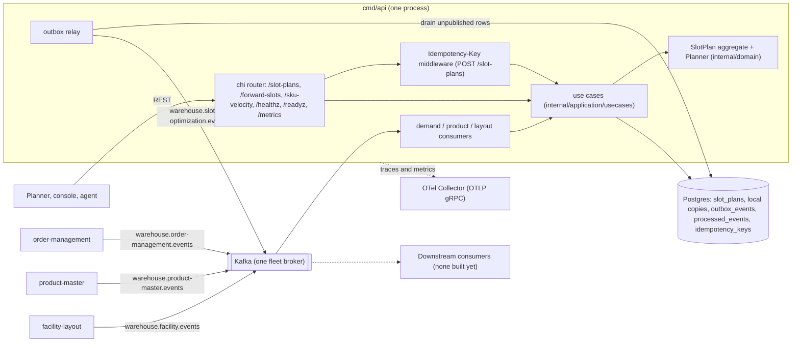
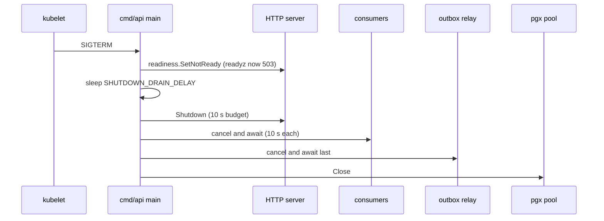

# Architecture

`slotting-optimization` is one Go module (`github.com/claudioed/slotting-optimization`)
built as a hexagonal (ports and adapters) service. It ships **one binary**,
`cmd/api`, which runs the REST API, the three local-copy Kafka consumers and the
transactional-outbox relay in one process.

## Binaries

| Binary | Role | Listens on | Background workers |
| --- | --- | --- | --- |
| `cmd/api` | Composition root: reads the environment, builds the adapters (Postgres or in-memory), runs the embedded migrations, wires the use cases into the chi router, starts the consumers and the relay, and shuts everything down in order on `SIGINT`/`SIGTERM`. | `HTTP_ADDR` (default `:8080`): the REST API, `GET /healthz`, `GET /readyz`, `GET /metrics` | demand consumer (`DEMAND_MODE=kafka`), product consumer (`PRODUCT_MODE=kafka`), layout consumer (`LAYOUT_MODE=kafka`), outbox relay (always; `EVENT_PUBLISHER` picks the sink) |

There is no MCP binary, no analytics projector and no reports binary on
`develop`; ADR 0001 and ADR 0004 name those as later phases. There is no other
port: OpenTelemetry is pushed over OTLP/gRPC to `OTEL_EXPORTER_OTLP_ENDPOINT`.

## Layers

| Layer | Package | Contents |
| --- | --- | --- |
| Domain | `internal/domain/slotplan` | The `SlotPlan` aggregate root, its value types (`PlanID`, `SiteID`, `SKU`, `SlotCode`, `Window`, `State`, `ABCClass`, `MoveKind`, `UnassignedReason`, `Assignment`, `Move`, `Unassigned`), its commands (`Generate`, `Approve`, `Reject`, `Supersede`, `Restore`) and its three events. |
| Domain | `internal/domain/planning` | The pure `Planner` domain service (policy `abc-velocity-v1`), the `SlotRankingPolicy` port and its v1 implementation `LexicalRanking`. No I/O, no clock. |
| Application | `internal/application/usecases` | Seven request use cases (`GeneratePlan`, `ApprovePlan`, `RejectPlan`, `GetPlan`, `ListPlans`, `ListForwardSlots`, `ListSkuVelocity`) and six consumer use cases (`ApplyDemandChanged`, `ApplyProductClassified`, `ApplyPhysicalProfile`, `ApplyZoneRegistered`, `ApplyLocationSlotRegistered`, `ApplyLocationSlotDecommissioned`). |
| Application | `internal/application/ports` | Out-port interfaces only: `SlotPlanRepository`, `DemandLedger`, `ProfileDirectory`, `SlotCatalogue`, `IDGenerator`, `OutboxRepository`, `EventEncoder`, `ProcessedEvents`, `UnitOfWork`, `Clock`. |
| Application | `internal/application/repository`, `internal/application/outbox` | The ports' non-interface vocabulary: typed errors (`ErrPlanNotFound`, `ErrConcurrentModification`, `ErrApprovedPlanConflict`, `ErrProfileNotFound`), filters, local-copy value types and the outbox `Message`. |
| Inbound adapter | `internal/adapters/inbound/http` | chi router, RFC 7807 problem mapping (`errors.go`), the transactional `Idempotency-Key` middleware (`idempotency.go`), the readiness gate (`readiness.go`), DTOs. |
| Inbound adapter | `internal/adapters/inbound/kafka` | The three consumers (`demand_consumer.go`, `product_consumer.go`, `layout_consumer.go`), the at-least-once run loop (`kafka.go`) and dead-lettering (`deadletter.go`). |
| Shared adapter | `internal/adapters/kafka/cloudevents` | The only place a CloudEvents 1.0 envelope is built (`New`) or decoded (`Decode`). |
| Outbound adapter | `internal/adapters/outbound/postgres` | pgx repositories, the unit of work (`pgtx` carries the transaction in the context), the outbox store and the golang-migrate runner over the embedded `migrations/*.sql`. |
| Outbound adapter | `internal/adapters/outbound/memory` | In-memory implementations of every port (used when `DATABASE_URL` is unset, and by the BDD suite). |
| Outbound adapter | `internal/adapters/outbound/kafka` | `Encoder` (domain event to outbox row) and `RelaySink` (kafka-go writer). |
| Outbound adapter | `internal/adapters/outbound/outbox` | The relay loop and the `LogSink`. |
| Outbound adapter | `internal/adapters/outbound/telemetry`, `clock`, `ids` | OTLP tracer and meter providers plus the Prometheus handler, the system clock, `plan-<uuid v4>` ids. |
| Support | `internal/bootretry` | Exponential-backoff retry for the first Postgres dial (migrations and first ping). |
| Fitness | `internal/architecture` | arch-go and AST fitness tests that keep the layering, the CloudEvents rule and the no-auth rule ([Testing](/docs/development/testing)). |

The dependency rule is enforced by `TestHexagonalArchitecture`
(`internal/architecture/architecture_test.go`): the domain imports nothing from
the application or adapters, the ports package contains interfaces only, and
adapters never import each other (the composition root passes the Postgres
transaction binder `pgtx.With` into the HTTP idempotency middleware for that
reason).

## Component diagram

Source: `cmd/api/main.go`, `internal/adapters/inbound/http/server.go`,
`internal/adapters/inbound/kafka/consumer.go`,
`internal/adapters/outbound/outbox/relay.go`,
`internal/adapters/outbound/postgres/migrations/0001_slotting_schema.up.sql`.

## Data stores

| Store | What lives there | Notes |
| --- | --- | --- |
| Postgres (`DATABASE_URL`) | `slot_plans`, `slot_plan_assignments`, `slot_plan_moves`, `slot_plan_unassigned` (the aggregate); `demand_lines`, `product_profiles`, `zones`, `slots` (the three local copies); `outbox_events` (transactional outbox); `processed_events` (consumer idempotency); `idempotency_keys` (REST idempotency); `schema_migrations` (golang-migrate) | One migration, `0001_slotting_schema.up.sql`, embedded in the binary and applied at boot. Pool: `MaxConns = 10`, `statement_timeout = 5s` per connection (`postgres/pool.go`). The full schema is on the [entity-relationship](/docs/ddd/entity-relationship) page. |
| In-memory | the same ports, held in maps | Selected when `DATABASE_URL` is unset. No `Idempotency-Key` middleware in this mode (the header is ignored), and everything is lost on exit. Used by `make test` and the BDD suite. |
| Kafka | the topics above | Readers and writers never dial at construction; a broker outage never blocks boot. |

## Process lifecycle

Boot order (`run` in `cmd/api/main.go`): logger, OpenTelemetry (non-blocking),
adapters (when `DATABASE_URL` is set: migrations through
`MIGRATIONS_DATABASE_URL` with up to 5 attempts and 1 s, 2 s, 4 s, 8 s backoff,
then the pool and a retried ping; failure exits the process), the Prometheus
handler, the HTTP server, the consumers, the relay.

Shutdown order on `SIGINT`/`SIGTERM` (`serveUntilSignal`): `/readyz` flips to
`503 {"status":"not_ready"}`, the process waits `SHUTDOWN_DRAIN_DELAY`
(default 5 s), the HTTP server drains (10 s budget), the consumers are cancelled
and awaited (10 s each), the relay is cancelled and awaited last, then the
Postgres pool closes and telemetry flushes (5 s).

Source: `cmd/api/main.go` (`serveUntilSignal`, `await`, `shutdownDrainDelay`),
`internal/adapters/inbound/http/readiness.go`.
